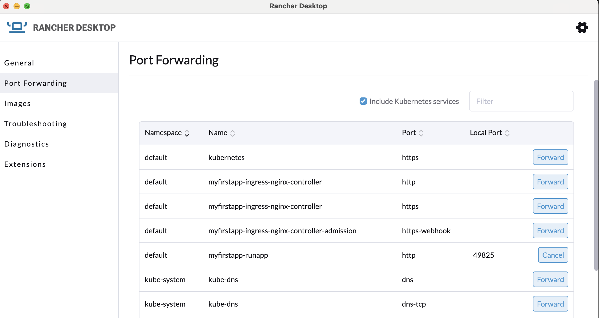
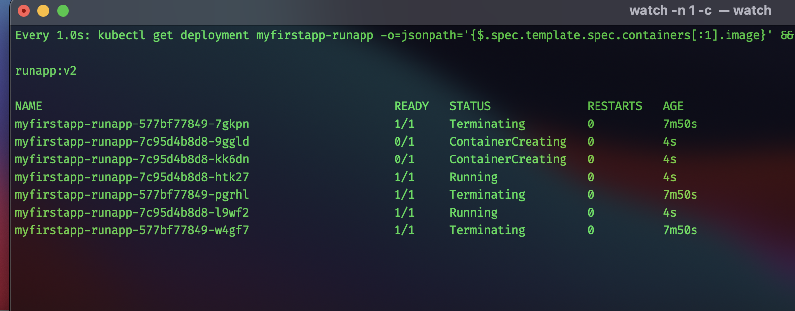

# Module 2

## Ruby App On Local K8

### Steps:

1. **Clone the Ruby Code from GitHub**

  ```
  git clone https://github.com/manukoli1986/devops-task.git
  ```

2. **Build a Docker Container Image. I am using below format to dockerize the ruby code.**

  ```
  $ cd devops-task/Ruby_App_Deploy/Docker

  # Use an official base image with minimal OS (Alpine is commonly used for its small size)
  FROM ruby:2.7-alpine

  # Set the working directory in the container
  WORKDIR /app

  # Copy the application code into the container
  COPY . .

  # Expose the port your Ruby application will run on
  EXPOSE 80

  # Define environment variables (customize as needed)
  ENV RAILS_ENV=development

  # Run the Ruby application as a non-root user (for security)
  RUN adduser -D -u 1000 appuser
  USER appuser

  # Start the Ruby application
  CMD ["ruby", "http_server.rb"]

  ```

  Build the Docker image with the following command:

  ```
  docker build -t rubyapp:latest . 
  docker http://localhost:8080/healthcheck
   
  For Old Code
  curl --http0.9  http://localhost:8080/healthcheck
  curl --http0.9  http://localhost:8080/
  ```

3. **Create/Generate Helm chart for the app. I am using Helm 3 (Latest version)**

  ```
  helm create myfirstapp
  ```

4. **Adding ingress-nginx controller as dependency as we are running individual application on cluster and If we run the same code on Cloud (With Pre-DNS setup) then It will be accessibe on domain name.**
  ```
  helm repo add ingress-nginx https://kubernetes.github.io/ingress-nginx
  helm repo update
  helm dependency update
  ```

5. **Deploy App on local K8**

  ```
  helm upgrade --install myfirstapp ./helm  

  ```

6. **Verify the application is running as expected on local k8 cluster. I am using Port-forward method from Rancher Desktop UI to verify it.**

  Enabling Port-Forward 
  

  ```
  devops-task/Ruby_App_Deploy/helm on  main [!?] is 📦 v0.1.0 via ⎈ v3.12.3 on ☁️ 
  ❯ curl localhost:49693 
  Well, hello there%                                                                                                                                                                         
  devops-task/Ruby_App_Deploy/helm on  main [!?] is 📦 v0.1.0 via ⎈ v3.12.3 on ☁️
  ❯ curl localhost:49693/healthcheck
  OK%   
  ```

7. **Zero Downtime Stratretgy**
  
  There are multiple options to managed deployment strategy with Zero Downtime requirement i.e. rollout, canary, a/b, blue-green. It would be depend upon the cost, infrastructure use, the criticality of application that which strategy we have to opt. 

  For this requirement, I am going to use Rollout strategy. However this is the default option of K8 deployment way but I am goint to explain it as per the need. 

  Rolling updates allow deployments to take place with zero downtime by incrementally updating Pods instances with new ones. In association with Health Checks, it is possible to deploy a new version of the application without any downtime.

  In the schema above, we can see a new version of the deployment: the ReplicaSet 2 with a running pod. Then the old pod from ReplicaSet 1 is terminating. The operation is repeated 3 times. With Health Checks we do not suffer any outage. At any moment I have 2 running pods.

  Most of the time, default options are great but you may have to customize them. For example if your application cannot run with two different versions at the same time.

  


8. **Update values.yaml to achieve requirements**

|                               **Requirement**                           |                **Solution**             |
|:----------------------------------------------------------------------:	|:--------------------------------------:	|
| Highly available and load balancer                                     	| Using Replicas                         	|
| Ensuring the application is started before served with traffic         	| Using Livenessprobe and Readinessprobe 	|
| Safeguards for ensuring healthy lifecycle of applications              	| Using HealthCheck                      	|
| Ensure zero downtime                                                   	| Deployment Strategy  - Rollout         	|
| Endpoints of the web application are accessible outside the cluster    	| Using Ingress                          	|


## Problem:

1. Getting below error when running the old ruby code on local k8. and dockerize it. When running on K8 cluster and using livenessprobe it is failing we tried to use httpget and tcpsocket but problem was same as it is using old http protocol.  


  ```
  http_server.rb:7:in `readpartial': end of file reached (EOFError)
    from http_server.rb:7:in `block in <main>'
    from http_server.rb:5:in `loop'
    from http_server.rb:5:in `<main>'

  ###   The error message "end of file reached (EOFError)" occurs because your code is trying to read from a socket 
  ###   that has reached the end of the file (EOF). In the context of a web server, this error typically means that
  ###   the client has closed the connection, and your server is attempting to read from a closed socket.
  ```

  Even I tried to run first on docker and it was running but when hitting from chrome browser, it was throwing the above error. However, the Curl was running but by passing --http0.9 version. Like this..

  curl --http0.9  http://localhost:8080/healthcheck
  curl --http0.9  http://localhost:8080/

  But this is not the agenda of task. Hence I checked the code and with the help of google the issue could be resolved by adding error handling to check if the client socket is still open before attempting to read from it. Here's a modified version of your code that includes error handling for reading from the client socket:


  ```
  require 'socket'

  server = TCPServer.new(80)

  loop do
    client = server.accept

    begin
      request = client.readpartial(2048)
    rescue EOFError
      # Client closed the connection, so we can't read more data.
      client.close
      next
    end

    method, path, version = request.lines[0].split

    if path == "/healthcheck"
      response = "HTTP/1.1 200 OK\r\nContent-Length: 2\r\n\r\nOK"
    else
      response = "HTTP/1.1 200 OK\r\nContent-Length: 17\r\n\r\nWell, hello there!"
    end

    client.write(response)
    client.close
  end

  ```


# Module 3

  This is an open-ended assignment, you are free to introduce changes, in the assigned time frame, to the application or in the instrumentation to meet your standards in terms of security, availability, reliability and observability.

  We made an overview on how to secure a deployment on Kubernetes to be resilient and performant. It relies on:
  -----------------------------------------------------------------------------------------------------------------------------------------------------

  According to the best practice for K8 Cluster wheather in the cloud or on-prem, it is really crucial for ensuring the reliability, scalability, and security of the applications provisioned on K8 cluster. Here are some key best practices which I would recommend:


  - Affinity/Antiaffinity/NodeSelector
  For worker nodes, this is mandatory practice to deploy the pod with affinity, antiaffinity or nodeselector config setting. We can use above choice which meet our requirements. Even if we configured several replicas, they should not belong to the same node — the server hosting pods. Because if the node is down and your pods replicas are on this server, then your application will be down too(link). So you have to configure podAntiAffinity most of the time.

  - Resource Quotas and Limits
  We should enforce quotas to prevent resource exhaustion and set the resource limit on pods to control usage. 
  
  - CPU & Memory requests
  CPU & memory allocation are compute resources assignment to the pod. When we do not configure CPU or memory requests, Then it will start consuming all memory and CPU as per the need and there would be no hold on to that. And if we deploy new application on same cluster we might get issue of memory or CPUs. i.e. insufficient resources allocation or out-of-memory issues. I would recommend setting up the CPU and memory requests to the lowest possible value

  - HPA - Horizontal Pod Autoscaler
  In some circumstances, our fixed replicas setting cannot handle a large amount of requests on our cluster. This may lead to issues even if all pods are correctly working. One of the great features of Kubernetes is to benefit from the HPA. HPA is the way to do autoscaling with Kubernetes.
  Setting a basic HPA based on CPU real usage is advised to handle the traffic correctly and adapt the costs too.

  - Monitoring & Logging
  I have used Prometheus and Grafana and ELK, to monitor the metrics of application to track the APIs request and also use log management i.e. elk or datadog or splunk to track the logs produced by application running on container. 

  - Multi-AZ or Multi-Region Deployment:
  We should distribute our cluster across multiple Availability Zones (AZs) or regions for high availability. Or we ca use the Google Anthos which works as Federation and can connect multiple cluster from diffferent cloud providers. This will make our application more High Available and more Fault Tolerant. 

  - Security 
    - Network Policy
      Network policy prevents the communication between pods and namespaces in k8 cluster. We can create multiple network policy. It works as firewall in cluster. 
    - RBAC
      Implement RBAC to restrict access to resources and API operations and we can define roles and role bindings that grant minimal necessary privileges.
    - PSP - Pod Security Policy
      We can use it to define and enforce the policies for pods i.e. Control pod capabilities, run as non-root, and other security-related settings
    - Image Security
      We can use trivy to scan the docker or application images before deploy to check the vulnerabilities. 
      
